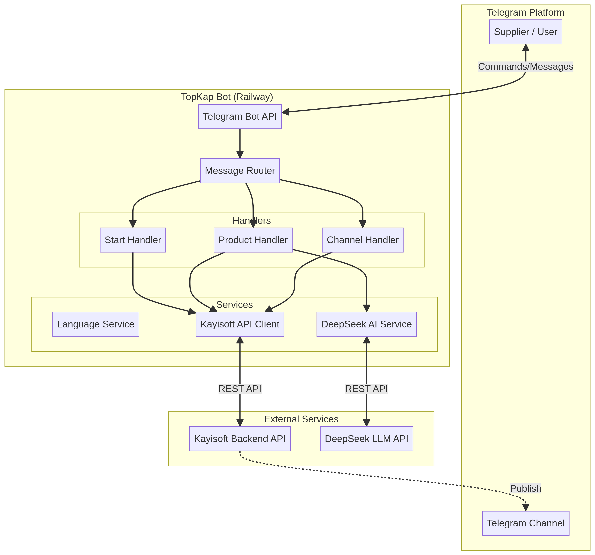
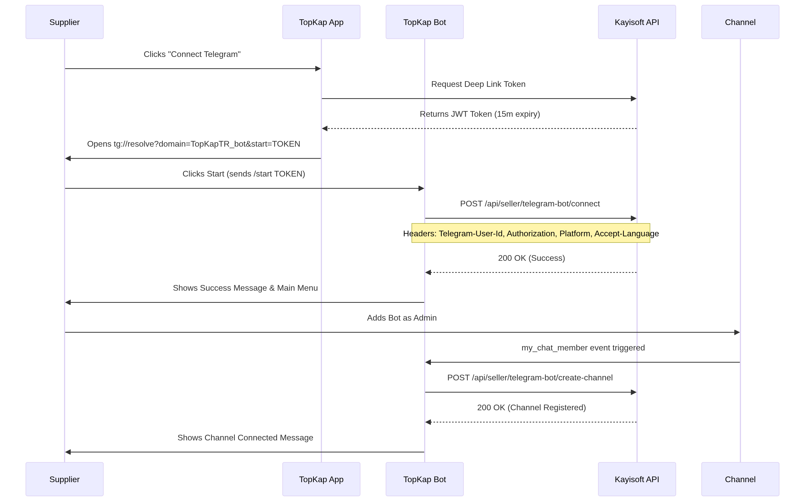

<div align="center">
  
  
  # TopKap Telegram Bot 🇹🇷
  
  **The Ultimate Wholesale Textile Hub for Turkish Suppliers**
  
  [](https://python.org)
  [](https://core.telegram.org/bots/api)
  [](https://railway.app)
  [](#)
</div>

---

## 📖 Overview

**TopKap Telegram Bot** is a professional, enterprise-grade Telegram bot designed specifically for Turkish textile wholesale suppliers. It acts as a seamless bridge between the TopKap mobile application and the Telegram ecosystem, allowing suppliers to manage their products, connect their Telegram channels, and publish directly to their audience with an intuitive, app-like experience.

Built with modern asynchronous Python (`python-telegram-bot` v20+), it features deep integration with the **KAYISOFT Backend API** and leverages **DeepSeek AI** for intelligent product attribute extraction.

---

## ✨ Key Features

- 🌍 **Multilingual Support:** Fully localized in Turkish (Default), Arabic, and English with dynamic language switching.
- 🤖 **AI-Powered Product Entry:** Uses DeepSeek LLM to automatically extract categories, subcategories, and attributes from natural language input.
- 🔗 **Seamless Account Linking:** Secure deep-link token authentication connecting the Telegram bot to the TopKap App.
- 📢 **Automated Channel Management:** Automatically detects when added as a channel admin and registers the channel for direct product publishing.
- 🎨 **Professional UX/UI:** Rich HTML formatting, interactive inline keyboards, and emoji-supported navigation.
- 🚀 **Enterprise Architecture:** Modular design, robust error handling, and containerized deployment ready for scale.

---

## 🏗 System Architecture

The bot follows a highly modular, service-oriented architecture to ensure maintainability and scalability.



### Core Components:
1. **Handlers (`bot/handlers/`):** Manage specific user flows (Start, Product Creation, Channel Management).
2. **Services (`bot/services/`):** Encapsulate business logic:
   - `KayisoftAPI`: Async HTTP client for backend communication with strict 4-header authentication.
   - `DeepSeekService`: AI integration for natural language processing.
   - `LanguageService`: Dynamic localization engine.
3. **Locales (`bot/locales/`):** JSON-based translation files for TR, AR, and EN.

---

## 🔄 Connection Flow

The account linking and channel connection process is designed for maximum security and user convenience.



### 1. Account Linking
1. Supplier clicks "Connect Telegram" in the TopKap App.
2. App generates a short-lived JWT token (15m expiry).
3. App opens Telegram via deep link: `tg://resolve?domain=TopKapTR_bot&start=TOKEN`.
4. Bot receives the token, validates it via KAYISOFT API, and links the account.

### 2. Channel Connection
1. Supplier adds the bot to their Telegram channel as an Administrator.
2. Bot detects the `my_chat_member` event.
3. Bot automatically registers the channel ID and Name with the KAYISOFT API.
4. Supplier receives a localized success message and can start publishing.

---

## 🚀 Deployment Guide

The project is fully containerized and optimized for deployment on **Railway**.

### Prerequisites
- Python 3.11+
- Telegram Bot Token (from [@BotFather](https://t.me/BotFather))
- KAYISOFT API Base URL & Token
- DeepSeek API Key

### Environment Variables (`.env`)
```env
BOT_TOKEN=your_telegram_bot_token
KAYISOFT_API_URL=https://api-wholesale.dev.kayisoft.net
KAYISOFT_API_TOKEN=your_kayisoft_api_token
TELEGRAM_BOT_API_ENDPOINT_KEY=your_endpoint_key
DEEPSEEK_API_KEY=your_deepseek_api_key
ADMIN_TELEGRAM_ID=your_telegram_id
```

### Local Development
```bash
# 1. Clone the repository
git clone https://github.com/ahmedlazkani/TurkTextileHub.git
cd TurkTextileHub

# 2. Install dependencies
pip install -r requirements.txt

# 3. Run the bot
python -m bot.main
```

### Railway Deployment
1. Connect your GitHub repository to Railway.
2. Railway will automatically detect the `Dockerfile` and `railway.json`.
3. Add the required Environment Variables in the Railway Dashboard.
4. Deploy! 🚀

---

## 📚 API Integration Details

All requests to the KAYISOFT API are authenticated using a strict 4-header system:

| Header | Description |
|--------|-------------|
| `Telegram-User-Id` | The unique Telegram ID of the user making the request. |
| `Authorization` | Bearer token for API access. |
| `Platform` | Always set to `telegram`. |
| `Accept-Language` | The user's selected language (`tr`, `ar`, `en`). |

*Note: The API client includes automatic sanitization to prevent HTTP header injection vulnerabilities.*

---

## 📄 License

**Proprietary Software**  
All rights reserved to **TopKap** & **KAYISOFT**. Unauthorized copying, modification, or distribution of this software is strictly prohibited.
